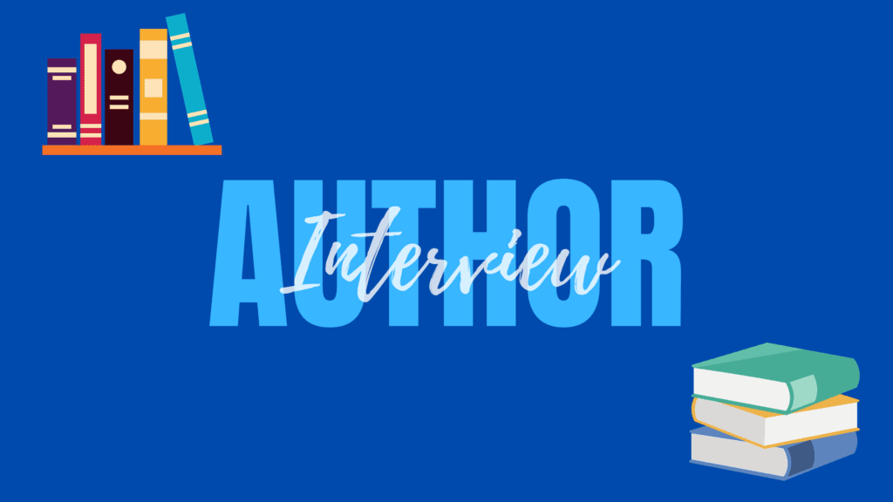
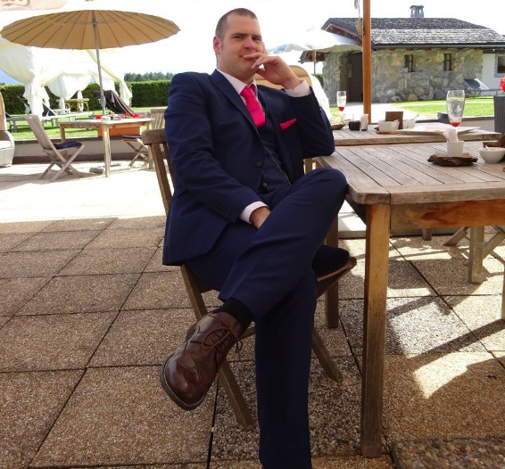

Hello everyone! Today I have an author interview for you with Dr. Stuart Knott. Read the box below to find out more about Dr. Stuart Knott and then keep reading for the interview!

Dr. Stuart Knott

His latest book, **Nightshade: The Inception**, is a coming of age story, a thriller, in which a teenager suffers a life-changing break-up, and, in his anger, unexpectedly adopts a vigilante persona in a town on the brink of complete anarchy. You can find the book on [Amazon](https://www.amazon.co.uk/Nightshade-Inception-Dr-Stuart-Knott/dp/B08XZGQ8TW/ref=sr_1_1?keywords=nightshade+inception&qid=1621249942&s=books&sr=1-1) in both paperback and Kindle formats.

Dr. Knott also runs a website where he reviews movies, comic books, and video games, which you can find at [Dr. K's Waiting Room](https://drkwaitingroom.com).

You can also find him on [Facebook](https://www.facebook.com/skteamos/), [Twitter](https://twitter.com/DrK_PhD), and Instagram.

## The Interview

CBB: Do you read (or plan to read) reviews of your books? If so, how do you handle (or plan to handle) good or bad reviews?   
  
DR K: I absolutely plan on reading every single review I get, whether they are good or bad. When I get a review, I often share it on my social media and use it as an excuse to thank those who’ve supported me or initiate a writer’s lift to help get other writers’ work promoted. I’m not too worried about bad reviews; different people like different things and it’s helpful to gauge what my audience is looking for for any future works. 

CBB: What is the best way you’ve found to market your books?   
  
DR K: So far, it’s mainly been about social media presence, particularly Twitter. There are regular writer’s lift promotions happening all across the writing community that I take part in, which is great for promoting a book to a lot of people very quickly. Instagram has also been good too, but paid promotions and reaching out to blogs are also great ways to get your book out there as long as you have the budget and don’t mind being a little bold. 

CBB: Are there any authors that you just didn’t like their work at first, but eventually came to like?   
  
DR K: Generally, I tend to go by genre; if I’m reading horror or science-fiction, I feel like I’ll probably enjoy the book no matter who has written it but there are obviously exceptions. Stephen King is one of my favourite writers, for example, but I don’t like every single one of his stories; similarly, I tried some H. P. Lovecraft recently and found it to be very hit and miss, so it all depends on the style the story adopts and how patient you are with a book, I think. 

CBB: What do you think is the most unethical practice in the publishing industry?   
  
DR K: Easily these so-called “vanity publishers”; these people will lure you in with praise and promises of publishing your work to a wide audience and then suddenly slap a hefty price tag on their services. For first-time or independent authors, this can seem like a dream come true as getting any response or feedback from a submission is like finding gold dust but don’t be fooled. Do some research into the company and see what other writers have to say; it might be better to save yourself thousands of pounds/dollars and self-publish your book rather than be left out of pocket and still unrecognised. 

CBB: What was your favorite book as a child? Did it influence you to become a writer?   
  
DR K: I read a lot of the _Star Wars_ books as a child (these have since been reclassified as “Legends”) but I mainly grew up watching movies; I’d watch a film, maybe read the novelisation, and this is what steered be towards Stephen King. _It_ was probably the first full-length, “real” novel I read all the way through and it definitely influenced the way I write in that it takes ordinary, everyday individuals and places and introduces an extraordinary element. 

CBB: Have you gone on any literary pilgrimages? If so, where have you gone?   
  
DR K: I can’t say that I have; I went to Shakespeare’s Globe in London once for a university trip and visited Stratford-Upon-Avon but that’s about the closest I would say I’ve gotten to a pilgrimage of any kind. 

CBB: What is your favorite thing to listen to while you write?   
  
DR K: I have a whole playlist specially set up for when I’m writing; sometimes I add or take things from it if I’m trying to evoke a certain mood but I definitely like to listen to music when I’m working, especially if it provokes feelings from me. I’m a big fan of metal, nu-metal, and rock and some of my favourite bands are the likes of Disturbed, Cold, Breaking Benjamin, Five Finger Death Punch, and A Day to Remember but I have a range of different songs and artists on the go at any time. The only issue is my PC actually co-operating long enough t play the songs without crashing! 

CBB: Do you think it helps authors to have a big ego, or do you think it hurts them?  
  
DR K: I think it depends, really; I think some ego is definitely required as you should be proud of yourself and your work and be bold and out there when promoting it and trying to increase your audience. I think it’s important to stay humble, though; there will always be people better at different things and it’s better to just accept that and try to work with others, rather than against them, and to show the right balance of pride and humility. 

CBB: Do you ever have reader’s block or reading slumps? What do you do to get yourself out of them?   
  
DR K: Quite often, yes. I find that I don’t like to read books or novels if I’m in the middle of writing or editing one of my own, and sometimes I’m just not in the mood to read through a book even if it’s one of my favourites. This is why I read a lot of comic books and graphic novels instead as it can be much faster and easier and helps as a break between those slumps. 

CBB: Do you read the genre of books you write? Do you read your own books after you’ve finished them?   
  
DR K: Absolutely, yes. I’ve dabbled in writing my fair share of horror and science-fiction and these are my go-to genres. I think any writer definitely reads their own work back multiple times, especially during the editing process. I don’t tend to return to my books until a bit of time has passed, though, as I start looking for errors or further improvements and you have to draw a line somewhere but I tend to write in the genres I like, for sure. 

A big thank you to Dr. Stuart Knott for letting me pick his brain with these questions! I hope you enjoyed reading his answers as much as I did!
