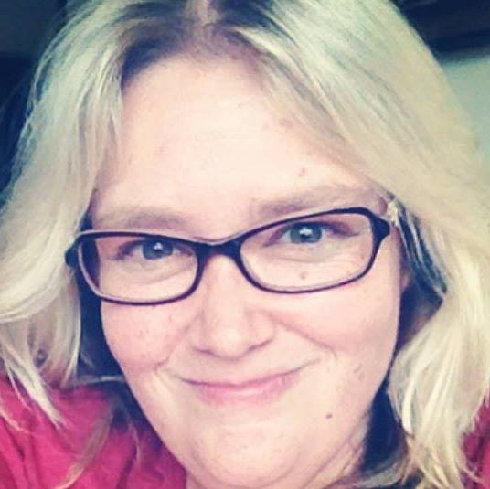

<figure>

<figcaption>

Amy Kaybach

</figcaption>

</figure>

Hi everyone! Today I'm bringing you a very special author interview - Amy Kaybach! Amy and I have been friends for years, bonding over NASCAR (Tony Stewart to be exact) and more recently, our love of books. Amy just released her debut novel, Bridging the Silence ([read my review here](https://www.charlisbookbox.com/book-reviews/bridging-the-silence-by-amy-kaybach/)), in March 2022 and her second book, Blending Chords, will be released on June 24, 2022.

You can find Amy at her website: [Amy Kaybach](https://amykaybach.com), on Twitter at [@AmyKaybach](https://twitter.com/amykaybach), and on Instagram at [@authoramykaybach](https://instagram.com/authoramykaybach).

Enjoy my interview with Amy Kaybach.

**Do you read reviews of your books? If so, how do you handle bad or good reviews?**  
  
_Right now, yes. Bridging the Silence is my first book so I do check on my reviews and read them. I want to know if there is something off. Or at least that is the excuse I give myself. So far my reviews have been positive, so I am still waiting for the negative review to come in. I can’t be sure how I’ll react until it happens. I'm not naive - I know it will happen. It's just a matter of when. Having a little bit of a thick skin from my job will hopefully come in handy. But I can see it possibly coming to a point where I have to stop reading them._ 

**What is the best way you’ve found to market your books?**   
  
_I’m still a baby author so I’m still learning to walk when it comes to marketing. I’m indie so I don’t have a huge advertising budget or anything like that. I’m mostly focused on trying to get my name out there. I do a lot on Instagram, mostly because that’s my favorite social media app because I’m a visual person and I love photography so I’ve always liked Insta the most even well before I became an author. I will seek out bookstagram accounts and follow them and interact with the account and try to forge a relationship with them. If they seem to like similar books as me or as what I write I will send them a blurb and offer them a comp copy if they are interested. That’s worked  well for me a few times. On Facebook I try to interact with other author’s readers groups, and sign up to do parties for their new releases just trying to get eyeballs on my book. Get people to see my name and say, Oh she’s been around a bit, maybe I should check her out. Unfortunately for me- I am not the best at saying “HEY LOOK AT ME” and never have been, so my introversion is not helpful when it comes to marketing. It’s to a point where I am having trouble balancing marketing and writing. I want to push myself and my content out there, but I have all these characters talking to me and wanting me to work on their stories._

**Are there any authors that you just didn’t like their work at first, but eventually came to like?**   
  
_I saved this one for last actually because it’s a hard question for me to answer. I have certain tropes that turn me off of a book as a reader- specifically in the romance genre. Personally I’m not a huge fan of age gap where the MMC is a lot older than the FMC. I’m also not a huge fan of the teacher/student trope either. So when I see or hear that those are the main themes in a book I will usually steer clear. A friend of mine recommended author Carian Cole to me and I balked when I read the description of her book Torn. I almost didn’t read it. And honestly it kind of pushed my boundaries as a reader. A couple of her other books also pushed me when it came to tropes I didn’t usually care for. But she is one of my favorite authors now because she somehow took something that I was opposed to and made me care about the story._

**What do you think is the most unethical practice in the publishing industry?**   
  
_I think the most unethical practices come from vanity publishers or people out there looking to take advantage of authors just starting their publication journey. I’ve been lucky so far but I was paralyzed with fear when it came to getting an editor. The idea of putting my book in the hands of someone who’s meant to basically tell you what’s wrong is scary enough. Editing is hugely expensive and I didn’t want to end up as one of those horror stories that I’d read about in author groups where someone takes their money and doesn’t return the book with edits. Or someone who steals the story to use themselves. I knew I needed editing help. I almost didn’t do developmental editing because it is the most cost prohibitive of the different types of editing. But I was lucky. I ended up choosing a newer editor and her prices were more in my price range. And did I luck out because she is a damn good dev editor. She’s made me a better writer on many fronts and her developmental suggestions have been amazing on all the books she’s worked on. My books are definitely better because of her. Taking advantage of someone’s inexperience is really low I think. Beginning indie authors don’t have a lot of extra money to throw around on finding another editor._ 

**What was your favorite book as a child? Did it influence you to become a writer?**   
  
_My first favorite book was a Little Golden Book called “The Wait For Me Kitten.” I don’t remember the name of the author. I don’t remember that making me want to be a writer, but I really loved the story and asked to be read it all the time when I was a little kid. I think the first book that I read where I thought, “Hey I might want to be a writer” was in fifth grade. I read The Outsider’s by SE Hinton.  I’ve since gone through several paperbacks of that book because I will re-read it often, even still. But when I found out she was sixteen when she wrote the book it made me think, wow, maybe this is something I can do. I was an advanced reader and read well above grade level through most of school. Luckily my parents where of the mind that I should read whatever I wanted to (I was reading Stephen King in junior high) and if I didn’t understand something they’d explain it to me. I definitely think their fostering my love for reading was one of the reasons I’ve become a writer._

**Have you gone on any literary pilgrimages? If so, where have you gone?**   
  
_Well, kind of. I live in Steinbeck country (Monterey County) and have been to or around many of the places where his books took place. I’ve read a lot of his stuff, I even took a class where we just studied different works by John Steinbeck in college. I’ve been to Cannery Row (including Doc Rickett’s Lab or Dora’s), The Pastures of Heaven, etc. But these are all local to me. I would love to go to England one day and see all the lit places there one day._

**What is your favorite thing to listen to while you write?**  
  
_I can’t have silence when I write. I need to listen to something. I find that when I have the TV on as background noise though I get distracted and end up watching TV. So what I listen to depends on the situation. I make playlists for my books on Spotify and listen to those. But sometimes even music is too distracting. If I find I’m too into the music I know I need to change over to background noise. Basically I go to YouTube and search either brown noise or ambient noise and play those in the background as I write. Brown noise is basically just like the sound of a fan or an engine. I have to be careful with the brown noise ones because sometimes they make me sleepy- so I definitely don’t listen to them if it’s late. So instead I’ll do ambient noise videos- I like the library or coffee shop ones the most- but they have to be super soft or my brain will start to eavesdrop on the conversations. I don’t use the ones with rain because they make me have to pee too much. My noise-canceling headphones are my favorite writing accessory besides my laptop. I should probably find a coffee shop and just write there but the problem with that is that I will eavesdrop and not work on the task at hand. (That said eavesdropping is one of the ways I get story ideas- I’ll hear a snippet of someone’s conversation and then my brain will create a story around this little snippet that I’ve heard)_

**Do you think it helps authors to have a big ego or hurts them?**   
  
_It’s a delicate balance. You need to have enough of an ego to believe in your writing and know that it’s good enough to put out there. You need to have the belief that you deserve to be out there occupying the space that other authors occupy.  But you can cross the line and turn off readers I think. I won’t name any names but I’ve definitely been turned off of an author based on how they treat their fans._ 

**Do you ever have reader’s block or reading slumps? How do you get yourself out of them?**   
  
_Oh my yes! I get into reading funks- that’s what I call them. Book hangovers are very real for me and usually start the funk. When I finish a really good book or really intense or angsty book I will then make sure that I change tropes and move to something lighter. If I haven’t found anything to read or nothing’s holding my attention I will change genres completely. I find that either of those things will usually snap me out of my funk. But sometimes I will do a reread of a favorite book or series instead. I have some go-to rereads. I find rereading comforting. It’s like visiting with an old friend. I’ve actually been wanting to do a reread of the Cake series but I’m too engrossed in my current read right now to do it. I’m not one of those people who can read multiple books at one time. I like to fully fall into the story and bopping between multiple books becomes more of a distraction for me. I’m jealous of the people who can read multiple books. There are so many books I want to read, but I have to do it one at a time._

**Do you read the genre of books you write? Do you read your own books after they’re finished?**   
  
_Yes- but I don’t read solely that genre. My favorite romances to read tend to be angsty and rockstar romances, but I also read small-town romances and I love a good sunshine/grump trope and throw a mechanic in the mix and I’m in because I also have a thing for cars. But, I also love a good psychological thriller. I like mysteries- I was a huge Sue Grafton fan and was devastated when she died before finishing the alphabet series. Simon Wood is a favorite and he’s written thrillers, mystery, and horror (under Simon Janus). I’ve read a lot of Stephen King. So I don’t just read romance, but I do tend to favor it. And I do tend to favorite a good angsty book whatever genre I’m reading. I want them to really earn that HEA when I’m reading. About my own book, yes I do read them but only because I’ve been needing to pull out teaser quotes for social media marketing. By the time a book has been published I’ve read it so many times through the editing process that my brain is tired of that story and ready to move on to the next._
