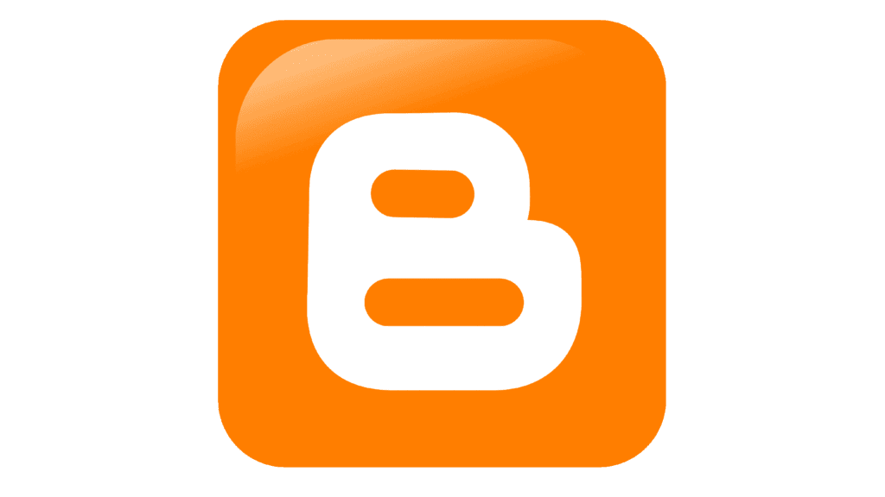

So you're considering starting a book blog. You've read several book blogs and you're thinking that's something you'd like to do. While most people would tell you pick a name first, I think the first thing you need to do is make a financial decision. That decision is how much money you want to invest in your new blog. **In fact, my recommendation is that unless/until you know you'll love blogging, you shouldn't spend any money on your blog.**

There's a reason I say this. That reason is - starting a blog can get expensive if you decide to "do it the right way" as most other blogging gurus will tell you. Allow me to explain. You could have hosting, domain, theme costs, and graphic design costs. Now you won't have all of these costs, but it's possible. Let's break down these costs shall we?

## Hosting Costs

Most blogging gurus will give you affiliate links\[mfn\]I'll be giving you one as well, just not to the same hosting company.\[/mfn\] to a hosting company and tell you that you **need** this host. Most of these hosting companies are going to require you to pay for at least a year's worth of hosting up front. No option for monthly payments, and if there _are_ monthly payment options, the price goes up. You could spend anywhere from $36 to over $100 for a year's worth of hosting. Some hosts even require you to do 2 or 3 years of hosting to get the special price - and they'll only refund you during the first 30 days after purchase. Another catch - these deals usually renew at the "regular" price, not the sale price. So when you do come up for renewal of your hosting, you'll pay the normal price, not the deal you got when you signed up.

Now... many hosts include a "free" domain name with your hosting package, but beware! That "free" domain name is only free for 1 year, and when it comes time to renew it, you'll have to renew at whatever the hosting company you picked charges for domain registration/renewal, unless you transfer the domain to a new registrar\[mfn\]I promise, I'll explain more about that in later posts.\[/mfn\]. If you don't renew the domain, then your blog's URL won't work anymore. Not ideal.

So let's go with the cheapest of the deals - which is Bluehost's deal that affiliates can offer you for $2.95/month, billed annually for $35.40 for the first year. They include a domain for the first year, so you won't have the domain registration expense your first year, but you'll have to pay for registration if you choose to continue after your first year.

So our running total so far is $35.40.

## Domain Costs

Now, not all hosts include a domain name in their packages. Some require you to purchase the domain separately. You do not have to purchase your domain through your hosting company! There are a plethora of domain registrars\[mfn\]Websites/companies that can register domains on customers' behalf.\[/mfn\] that you can choose from. I usually register through Namecheap or GoDaddy, depending on who is offering a good deal. Both registrars tend to offer .com domain discounts for first time buyers. Namecheap will often have sales on registrations or renewals, and you can often find coupon codes to help as well. For example, right now, Namecheap is running .com registrations for new customers at $5.98. Some registrars charge over $20 for a .com domain, so do some research on pricing before you buy. Since we used Bluehost in our example, we won't have to register a domain name, I just wanted to give you an idea of what you could be facing if you choose a host that doesn't include a domain.

Running total so far: $35.40

## WordPress Costs

Once you have your hosting and domain name, you'll have to install self-hosted WordPress. The good news is, this is **FREE**. Most hosting accounts have the option to use a software installer like Softaculous to install WordPress for you, so it's just a couple of clicks, fill out some information, and WordPress will be installed for you. I'll be detailing installation of self-hosted WordPress in a later post in this series in case you decide to go with paid hosting from the get-go.

Running total so far: $35.40

## Theme Costs

Now, once your self-hosted WordPress is installed, you have the option to find a theme you like. You can either go with the default theme that comes with WordPress, find a theme in the theme repository for free and use it, or you can look for a paid theme. For paid themes, especially for book blogs, I highly recommend going with [Nose Graze's](https://shop.nosegraze.com) themes, particularly [Tweak Me v2](https://shop.nosegraze.com/product/tweak-me-v2/) - which this blog is using. This theme is $69 and comes with 5 customizable pre-made theme settings. You can do some pretty amazing things with this theme. So let's say you decide you want to use Tweak Me v2... that will add $69 to our running total. Many other themes are in the $75-$125 or more range, so for a paid theme, this is a great price.

Running total so far: $104.40

## Graphic Design Costs

If you want custom header graphics, featured images, etc., but don't have graphic design skills of your own, you'll need to hire a graphic designer to help you with that. There are quite a few graphic designers out there who will help you create graphics for your book blog. Prices can vary wildly by designer and often depends on what you're looking for. I've seen packages ranging from $50-$200 for graphics for a blog. We'll say it's going to cost you $100 for your graphics.

Running total so far: $204.40

There are other things as well - premium plugins like Ultimate Book Blogger that would add $35, upgrading free plugins like Yoast SEO, etc., that could bump up your running total as well. We're not going to mess with those - except we'll add Ultimate Book Blogger just because.

Running total: $239.40

I don't know about you, but I don't really have $239.40 to start a blog that I don't even know if I'm going to be interested in keeping up. I mean, just because you like reading blogs doesn't mean you'll necessarily like being a blogger. Know what I mean? I mean, I like watching football but I don't want to play! Keep in mind, the above total is just an example. Your total could be more or less depending on what you choose for hosting, etc.. So what can you do if you want to start a book blog but don't want all the costs? Start FREE!!!

## FREE Ways to Start Your Blog

There's a couple of ways you can go. The first one isn't the most popular but it does exist and it's fairly easy to use and that is Google's Blogger.

[Google's Blogger](https://blogger.com) is a very basic blogging service that lets you get a blog up and running quickly. Just be aware that there are tons of blogs on Blogger and the name/url you want might be taken. This one is great if you just want a super basic blogging interface that isn't too difficult to figure out. However it can be a royal pain to migrate to self-hosted WordPress later on from Blogger. It's possible, it's just a pain.

Your second option is to go with WordPress - but free WordPress.com!

For [WordPress.com](https://wordpress.com) blogs, you get the features of WordPress & its Jetpack plugin, but you don't have all the technical things to deal with regarding plugins, themes, etc.. It gives you an idea of how the Gutenberg Block Editor works. You can't customize your blog as much as you can with self-hosted WordPress, but if you decide you want to migrate to self-hosted, moving from WordPress.com is a lot easier than moving from Blogger. Just be aware that WordPress.com inserts ads on your blog that you won't get paid for\[mfn\]Unless you upgrade your plan, but again, that defeats the purpose of FREE blogging.\[/mfn\] You can even upgrade your plan for more freedom later if you find you want a domain but don't want to go to self-hosted WordPress.

Finally there's an option that only works if you have a friend who has hosting and a domain and is willing to let you piggyback with them. You could do a subdomain on a friend's blog with self-hosted WordPress.

If you're determined to start with self-hosted WordPress, but don't want to pay a bunch of money out to do so, you could try to find a friend who already has a paid hosting account. If you don't mind your URL being a subdomain off your friend's URL and your friend doesn't mind either, you could have a URL like https://mybookblog.charlisbookbox.com, and then have a separate WordPress installation for that subdomain. It would give you all the perks of self-hosted WordPress but for free\[mfn\]Or minimal cost if your friend wants a small payment from you.\[/mfn\]. I've done this for friends of mine before when they wanted to try blogging.

* * *

As you can see, you don't have to spend a bunch of money to start a book blog. You actually don't have to spend anything unless you truly want to. Now I'm not saying you have to start off with free options. If you have the money and you want to spend it, by all means, go ahead. If you know you'll stick with it, spend the money. But if you're not sure that blogging will be for you, if you're just trying it out, then I'd recommend not spending any money and going with a free option to start your book blog. It's better to create a blog on Blogger or WordPress.com or even on a friend's hosting that you aren't paying for and then realize you don't like blogging than to have spent out a bunch of money only to find you don't like blogging and are now out all that money.

Once you've made your decision on how much money you want to invest in your new blog, it's time to choose a name for your blog. We'll cover that in the next installment of this series.
